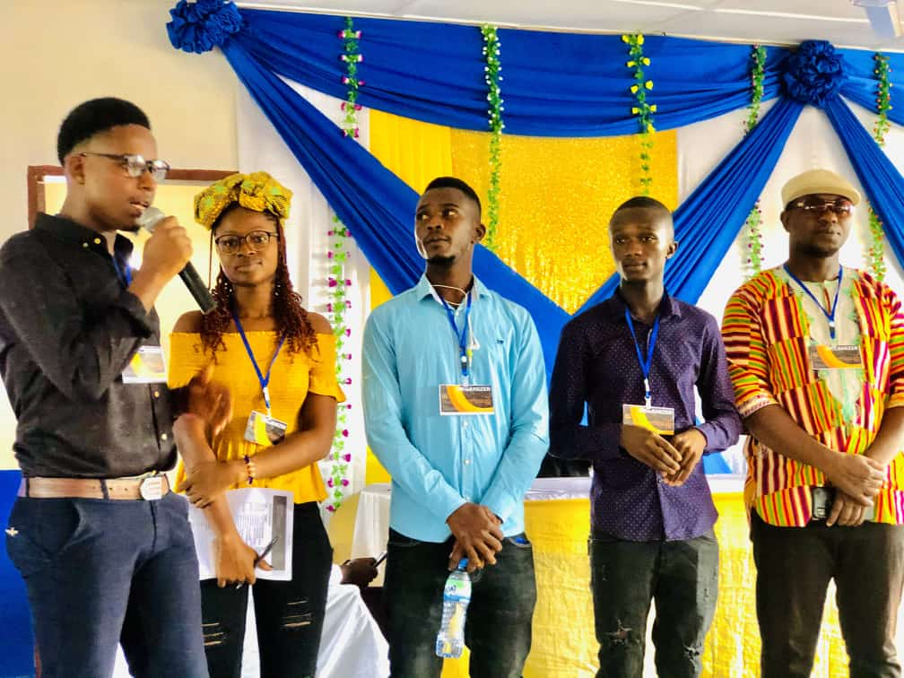

Young people are the linchpins in every society. They traverse every facet to maintain its safety, stability, and progress.

They are crucial to every nation or society as they represent the future workforce, propelling economic growth and innovation.

Their perspectives bring fresh ideas and vitality, contributing to societal progress.

They are the leaders of tomorrow who will either propel things forward or backward, to doom or gloom.

Now, let's examine the state of affairs of young people in this country. You would agree with me that it's deplorable, nothing to write home about.

Young people are confused and do not know what to do with their lives.

Many have resorted to substance abuse, stealing, and various self-destructive behaviors, thereby creating societal instability.

These are the young people who will take over the leadership and management of this country in the future.

What type of future do you think they are going to create? It's definitely not the great one that we look forward to seeing.

This is the time we should not expect that to happen amidst the *technological progress* the world has made.

We now have the internet, social media, and whatnot, yet young people are just muddling through to get by.

We now have the web and insanely powerful tools like AI to help everyone, especially young people to experiment and find their place in the world.

Despite these magical abilities we have achieved, young people are still stuck.

They simply can’t seem to navigate their way through personal growth and development.

That shouldn’t be. This is their era, their time to harness the opportunities of this new world with much less hassle.

But sadly, this is not the case, and many factors are at play for that. One of them is the limited access to in-demand skills.

The skills required to participate in this rapidly changing world, such as ICT, tech, networking, collaboration, etc.

Without a doubt, it is—and it will continue to be—impossible for this generation or the next to make any meaningful progress without these skills. The world has changed.

There is poverty, unemployment, inequality; you name them. But if young people are provided with the necessary skills and are given the basic tools, they can transform their lives and, in turn, impact their communities.

Young people are acquisitive. They want to turn their lives around, make money to take care of their loved ones, help develop their communities, build businesses, and inspire others. They want to be useful contributors to society.

However, most of them simply do not have access to acquire these skills. To be fair, some do, but even then they do not know how to harness it to their advantage.

This is why the Young Access Hub (YAH) exists.

This is why this organization exists: to bridge the gap between them and the essential skills and tools for self-transformation.

We plan to do that through a series of projects. One of them is to establish a learning hub that will make in-demand skills accessible to young people through in-person and virtual training initiatives.

Another is through summit events: a mindset reprogramming and networking event for young professionals and leaders to learn, inspire, and create meaningful connections.

And another is through competitive grant programs: to encourage young people to think of innovative and smart solutions to their community problems and compete for financial aid to support those initiatives.

Young people have something really powerful: potential.

Engaging and empowering young individuals promotes social stability, creating a foundation for sustainable development and a resilient society for all.
